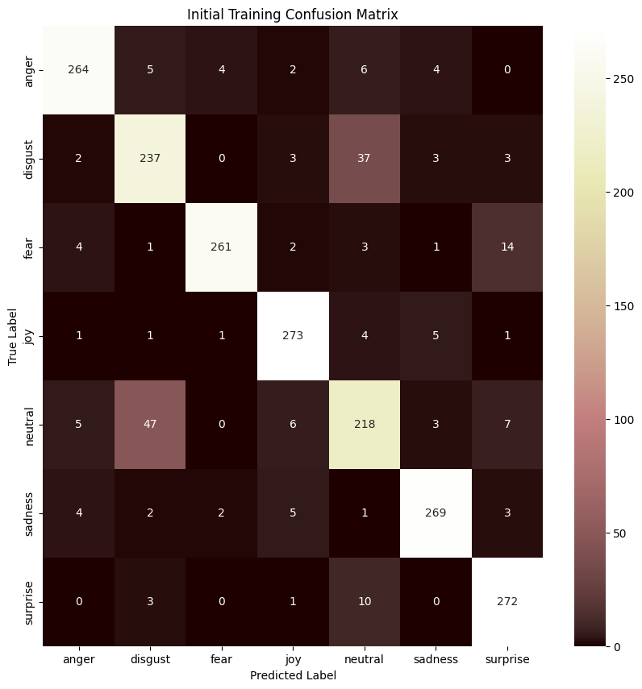
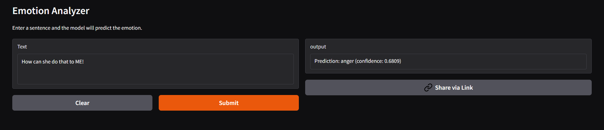
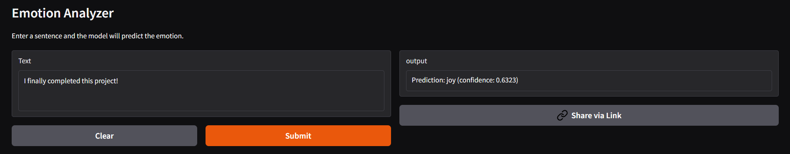

# Emotion Analyzer 

### Live Demo  
🔗 Try it here: [Emotion Analyzer](https://huggingface.co/spaces/Shaaranii12/emotion-analyzer)  

## Overview  
The **Emotion Analyzer** is a machine learning project that classifies emotions from text input.  

It uses **Natural Language Processing (NLP)** to classify text into emotions like anger, joy, sadness, fear, surprise, disgust, and neutral. The app was built with **Gradio** for the user interface and deployed on **Hugging Face Spaces** for public access.  

This project is part of my data science portfolio and demonstrates skills in NLP, deep learning, and interactive app deployment. 

## Features  
✅ Text Input: Enter any sentence and instantly analyze its emotion.  
✅ Prediction Results: Displays the detected emotion.  
✅ Interactive App: Simple and user-friendly interface for real-time emotion detection.  

## Screenshots
The model was fine-tuned using the j-hartmann/emotion-english-distilroberta-base transformer, and evaluated to measure its performance across different emotion categories

### Confusion Matrix
  

### Input and Prediction Examples

  

## Tools and Technologies used 
- **Python**  
- **Hugging Face Transformers** - pretrained and finetuned models
- **PyTorch**
- **Pandas & NumPy** 
- **Gradio** 

## Author
**Shaarani Navaratnam**
  Data Science Student 
  University Malaya
